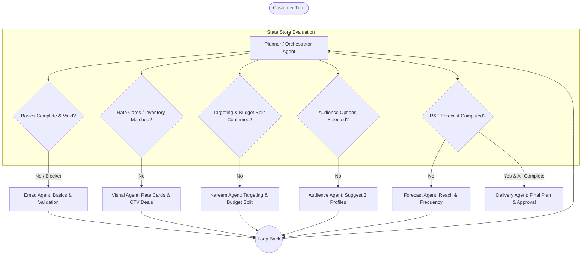
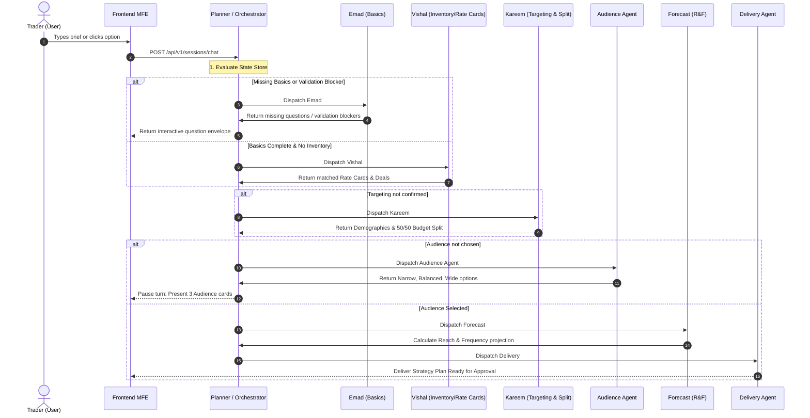

# Planner / Orchestrator Agent: Architecture & Execution Flow Documentation

## 1. Executive Summary

The **Planner / Orchestrator Agent** serves as the central brain and entry point of the VOW Campaign Planning multi-agent system (as defined in `docs/Workflow.jpeg` and `M1_Planning.txt`).

Rather than hard-coding static conversational steps, the Planner dynamically analyzes the shared state store on every turn, evaluates what information is present, what is missing, and what validation blockers exist, and intelligently dispatches execution to specialized sub-agents. After each specialized agent completes its task, control loops back to the Planner to re-evaluate state completeness.



---

## 2. Key Changes Implemented

### A. Shared State Store Expansion ([`state.py`](file:///c:/Users/nedah/OneDrive/Desktop/VOW%20Agent/backend/app/agent/state.py))
Extended `PlanningAgentState` with session tracing, revision control, rate card matching, and demographic slots:

```python
class PlanningAgentState(TypedDict, total=False):
    # --- Session & Elicitation Protocol ---
    client_message_id: str | None           # Client-side message deduplication key
    plan_version: int                       # Monotonically increasing revision counter
    active_elicitations: list[dict]         # Unanswered interactive UI options
    resolved_elicitations: list[dict]       # Answered/superseded UI questions
    resolved_blocks: list[dict]             # Resolved presentation blocks

    # --- M1 Domain & Targeting Slots ---
    inventory_type: str                     # "RATE_CARD" for M1
    matched_rate_cards: list[dict]          # Duration-matched rate cards (10s, 15s, 20s, 30s)
    demographics: dict[str, Any]            # Age tiers, Household Income, Gender
    budget_split: dict[str, float]          # Multi-channel budget allocation (e.g. {"Prime Video": 0.5, "Netflix": 0.5})
```

---

### B. Central Planner Orchestration Node ([`planner.py`](file:///c:/Users/nedah/OneDrive/Desktop/VOW%20Agent/backend/app/agent/nodes/planner.py))
Implemented `evaluate_state_and_plan` and `planner_node`:
- **Evaluates 6 State Domains**: Basics, Validation Errors, Inventory/Rate Cards, Targeting, Audiences, Forecast.
- **Returns Structured Orchestration Decisions**:
  - `next_agent`: Sub-agent identifier to dispatch.
  - `reason`: Human-readable justification logged for auditability.
  - `missing_fields`: Unanswered campaign requirements.
  - `conflicts`: Blocking validation issues requiring customer correction.
  - `is_complete`: Boolean flag indicating readiness for plan delivery.

---

### C. Dynamic Gate Routing ([`gates.py`](file:///c:/Users/nedah/OneDrive/Desktop/VOW%20Agent/backend/app/agent/gates.py))
1. **Added `route_planner(state)`**:
   Evaluates state via `evaluate_state_and_plan` and routes to the appropriate node in the LangGraph execution graph:
   ```python
   def route_planner(state: PlanningAgentState) -> str:
       decision = evaluate_state_and_plan(state)
       return decision["next_agent"]
   ```
2. **Enhanced `missing_basics(state)`**:
   Intelligently checks both raw slots (`flight_start`, `flight_end`, `budget_amount`) and composite objects (`flight_dates`, `market_budgets`), ensuring answered questions are never re-asked.

---

### D. Sub-Agent Enhancements

#### 1. Vishal Agent — CTV Inventory & Rate Cards ([`select_inventory.py`](file:///c:/Users/nedah/OneDrive/Desktop/VOW%20Agent/backend/app/agent/nodes/select_inventory.py))
- **M1 Compliance**: Switched from fixed deal structures to duration-matched rate cards.
- **Dynamic Rate Matching**: Matches creative durations (10s, 15s, 20s, 30s) against snapshot rate cards for Prime Video, Netflix, and Disney+.
- **State Output**: Writes `inventory_type="RATE_CARD"` and `matched_rate_cards` to state.

#### 2. Kareem Agent — Targeting & Budget Splitting ([`collect_targeting.py`](file:///c:/Users/nedah/OneDrive/Desktop/VOW%20Agent/backend/app/agent/nodes/collect_targeting.py))
- **Demographic Targeting**: Manages default and custom demographic segments (Age groups, Household Income).
- **Multi-Channel Budget Allocation**: Automatically calculates multi-channel budget allocations (e.g. 50/50 split across selected channels) and confirms before locking.

#### 3. API Contract & Elicitation Envelopes ([`sessions.py`](file:///c:/Users/nedah/OneDrive/Desktop/VOW%20Agent/backend/app/api/sessions.py))
- Added `resolved_blocks` and `plan_version` to `ChatResponse`.
- Constructed interactive `options` and `options_response` elicitation payloads adhering to `API CONTRACT/Response_options.json` and `Response_options_single.json`.

---

## 3. Detailed Step-by-Step Execution Flow

The end-to-end execution flow follows a 6-stage lifecycle:



### Stage Breakdown:

| Stage | Node / Agent | Trigger Condition | Output / Action |
|---|---|---|---|
| **1. Probe & Extract** | `extract_fields` | Incoming user message | Parses markets, dates, durations, budget into state |
| **2. Basics & Grounding** | `validate_basics` / `ask` | Missing fields or validation errors | Validates against snapshot; reports blockers (e.g. past dates, unsold markets) |
| **3. CTV Rate Cards** | `select_inventory` | Basics valid, inventory missing | Looks up duration-matched rate cards (10s, 15s, 20s, 30s) |
| **4. Targeting & Split** | `collect_targeting` | Inventory matched | Sets demographics (Age, HHI) and multi-channel budget split (e.g. 50/50) |
| **5. Audience Selection** | `suggest_audiences` | Targeting confirmed | Generates 3 audience profiles (Narrow, Balanced, Wide); pauses for trader selection |
| **6. Forecast & Delivery** | `predict_reach` & `deliver_plan` | Audience chosen | Computes formulaic R&F ($N = \frac{B}{\text{CPM}} \times 1000$) and delivers final plan |

---

## 4. Loopback & Trader Revision Handling

The Planner handles mid-flight revisions and loopbacks:

1. **Budget Modification**:
   - Trader updates budget (e.g., £50k $\rightarrow$ £75k).
   - Planner detects the budget update, preserves existing targeting/rate cards, invalidates the previous forecast, and automatically routes to `predict_reach` to update Reach & Frequency projections.
2. **Channel / Provider Switch**:
   - Trader changes preference (e.g., switches to Netflix).
   - Planner resets inventory selections, re-runs `select_inventory` to fetch Netflix duration rate cards, updates budget split, and recalculates forecast.
3. **Flight Date / Duration Correction**:
   - Trader corrects past flight dates.
   - Planner resolves the validation blocker, clears error state, and immediately advances to rate card matching.

---

## 5. Verification & Test Matrix

All 535 backend test cases pass with 100% success:

| Test Module | Tests | Status | Scope |
|---|:---:|:---:|---|
| `tests/unit/agent/test_planner_agent.py` | 22 | **PASS** | Dedicated Planner evaluation, gating, blockers, loopbacks, robustness |
| `tests/unit/agent/test_gates.py` | 42 | **PASS** | Gate routing, router dispatching, missing basics detection |
| `tests/integration/test_golden_journeys.py` | 3 | **PASS** | Multi-turn probing, complete one-shot, unsupported market rejection |
| `tests/component/agent/test_planning_graph.py` | 69 | **PASS** | Multi-turn conversation flows and state transitions |
| `tests/api/` | 25 | **PASS** | Chat endpoints, validation details, UI presentation blocks |
| `tests/security/` | 17 | **PASS** | OIDC token authentication and MCP token exchange |
| `tests/unit/knowledge/` | 138 | **PASS** | Snapshot ingestion, validation rules, rate card models |
| **Total Test Suite** | **535** | **100% PASS** | **Complete backend system verification** |
